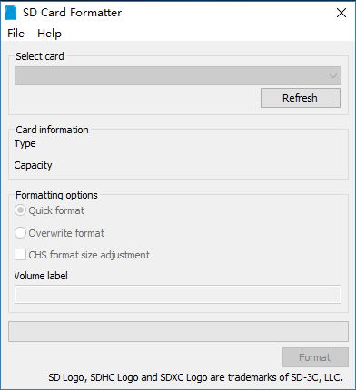
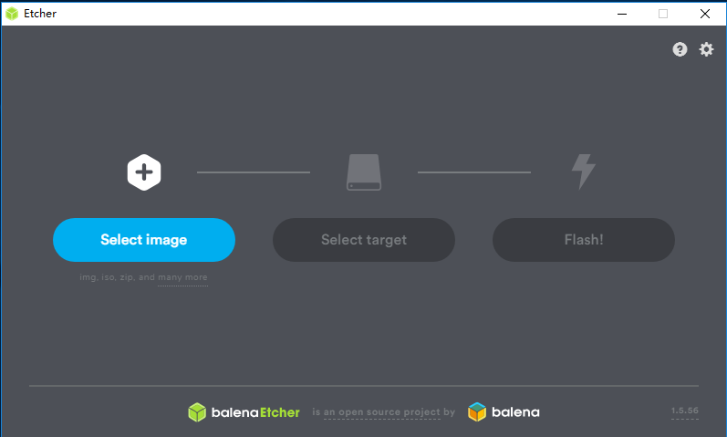

# Raspberry Pi Install

**My Device:** `Raspberry Pi 4B, 4GB RAM`

**SanDisk Card**
Requirement: `8GB, >= class 4`.
My : `64 GB, class 10`.

**Raspberry Pi Img**
Choose one Operating System Image from [Here](https://www.raspberrypi.org/downloads/raspbian/):
Recommend: `Raspberry-buster` and `Raspberry-buster-lite`.

Distinguish: Raspberry-buster-lite ==doesn't have UI==.
Raspberry-buster is a good choice for freshman, like me.

**Burning Boot Disk**
Here, prefer using `Windows` Operation System.

Format SD Card: Using `SD Card Formatter` format SD card firstly.

Burning Disk: Using `BalenaEtch` to generate Boot disk.

**Finally**
Now, we can insert SD card into Raspberry Pi.