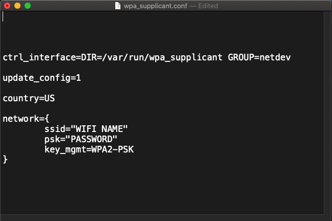

# Raspberry Pi Start / Connect

### With Display

1. Connect Display with HDML.

2. Connect Power with Type C.

3. Wait for set up, reset password and connect network.

### Without Display

**Because I use Mac here, other operating system should find a SSH tool to continue, like [PuTTY](https://www.putty.org)**

* With Network Cable
    * Make sure you can access Internet

    1. Enable `SSH`, create a SSH file (without suffix) under disk root folder, like SSH==~~.txt~~==
    
    2. Insert SD card, turn on the power and waiting for a moment to make sure Pi can connect the Internet.
    
    3. Find your  Pi's IP, you can use any `IP Scan Tool`, like [Advanced IP Scanner](https://www.advanced-ip-scanner.com)
    
    4. Using `ssh pi@192.168.0.5` in Mac Terminal (You should change IP here based on yours' Internet) to connect the Pi, default `username: pi` and `password: raspberry`

* Without Network Cable, using WI-FI
    
    * Make sure you can access Internet
    
    1. Enable `SSH`, create a SSH file (without suffix) under disk root folder, like SSH==~~.txt~~==
    
    2. Set up Wi-Fi file, create the wpa_supplicant.conf file under disk root folder, like `wpa_supplicant.conf`

        

    3. Insert SD card, turn on the power and waiting for a moment to make sure Pi can connect the Internet.
    
    4. Find your  Pi's IP, you can use any `IP Scan Tool`, like [Advanced IP Scanner](https://www.advanced-ip-scanner.com)
    
    5. Using `ssh pi@192.168.0.5` in Mac Terminal (You should change IP here based on yours' Internet) to connect the Pi, default `username: pi` and `password: raspberry`

* No Internet: **OK, Good, You should wait until you can access Internet.**

### Update

**Please update operating system after connected**

Using `sudo apt-get update` and `sudo apt-get upgrade`